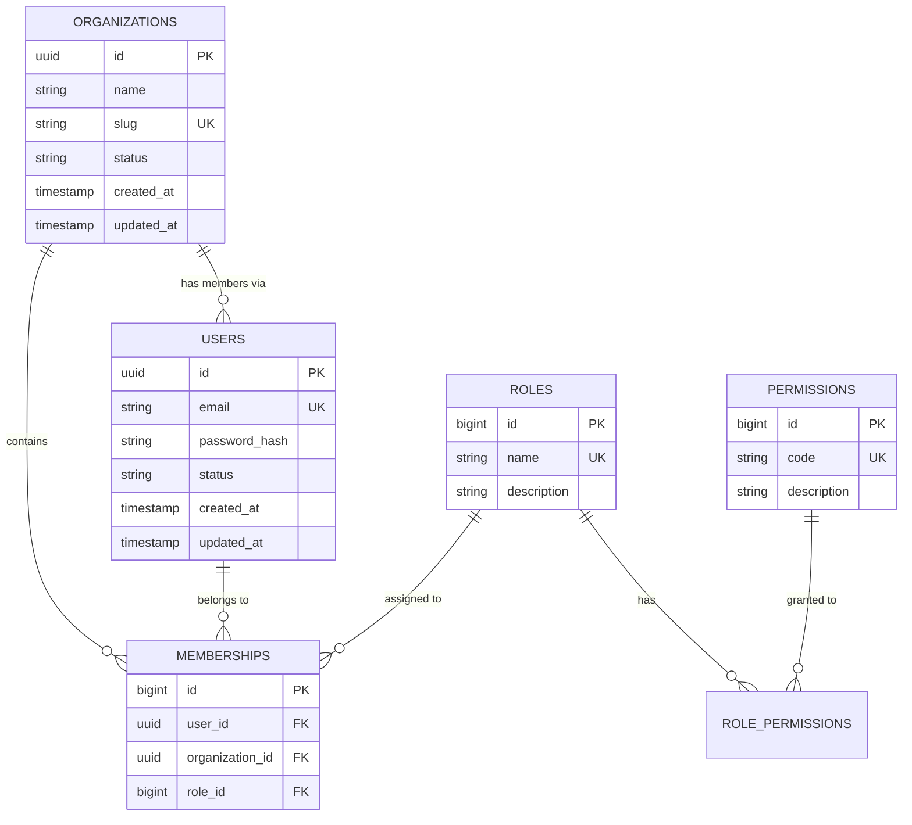

# Database Schema

```mermaid
erDiagram
    ORGANIZATIONS ||--o{ USERS : "has members via"
    ORGANIZATIONS ||--o{ MEMBERSHIPS : "contains"
    USERS ||--o{ MEMBERSHIPS : "belongs to"
    ROLES ||--o{ MEMBERSHIPS : "assigned to"
    ROLES ||--o{ ROLE_PERMISSIONS : "has"
    PERMISSIONS ||--o{ ROLE_PERMISSIONS : "granted to"

    ORGANIZATIONS {
        uuid id PK
        string name
        string slug UK
        string status
        timestamp created_at
        timestamp updated_at
    }

    USERS {
        uuid id PK
        string email UK
        string password_hash
        string status
        timestamp created_at
        timestamp updated_at
    }

    ROLES {
        bigint id PK
        string name UK
        string description
    }

    PERMISSIONS {
        bigint id PK
        string code UK
        string description
    }

    MEMBERSHIPS {
        bigint id PK
        uuid user_id FK
        uuid organization_id FK
        bigint role_id FK
    }
```
