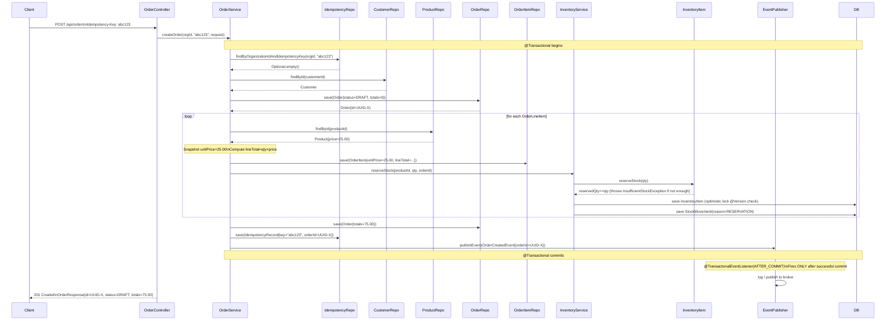
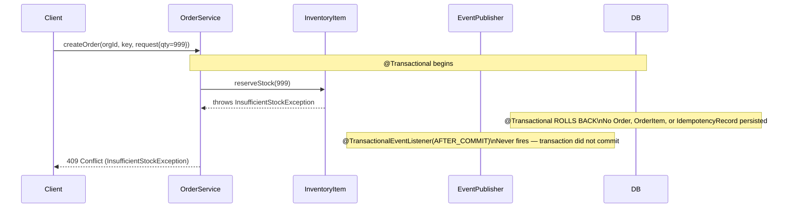
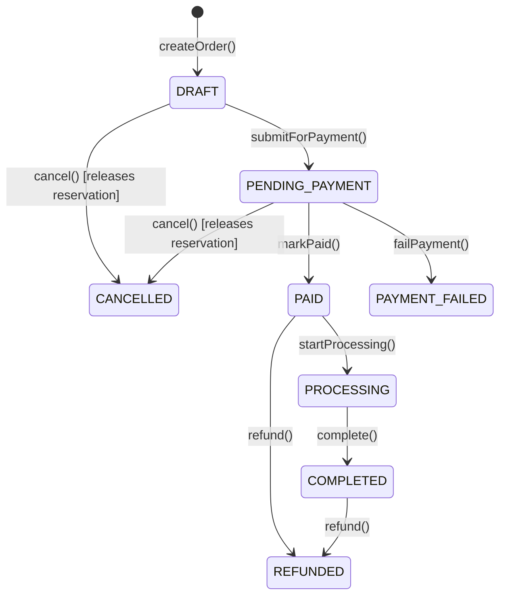

# Order Creation — Sequence Diagram

```mermaid
sequenceDiagram
    participant Client
    participant OrderController
    participant OrderService
    participant IdempotencyRepo
    participant CustomerRepo
    participant ProductRepo
    participant OrderRepo
    participant OrderItemRepo
    participant InventoryService
    participant InventoryItem
    participant EventPublisher
    participant DB

    Client->>OrderController: POST /api/orders\nIdempotency-Key: abc123
    OrderController->>OrderService: createOrder(orgId, "abc123", request)

    Note over OrderService,DB: @Transactional begins

    OrderService->>IdempotencyRepo: findByOrganizationIdAndIdempotencyKey(orgId, "abc123")
    IdempotencyRepo-->>OrderService: Optional.empty()

    OrderService->>CustomerRepo: findById(customerId)
    CustomerRepo-->>OrderService: Customer

    OrderService->>OrderRepo: save(Order{status=DRAFT, totals=0})
    OrderRepo-->>OrderService: Order{id=UUID-X}

    loop for each OrderLineItem
        OrderService->>ProductRepo: findById(productId)
        ProductRepo-->>OrderService: Product{price=25.00}
        Note over OrderService: Snapshot unitPrice=25.00\nCompute lineTotal=qty×price
        OrderService->>OrderItemRepo: save(OrderItem{unitPrice=25.00, lineTotal=...})
        OrderService->>InventoryService: reserveStock(productId, qty, orderId)
        InventoryService->>InventoryItem: reserveStock(qty)
        InventoryItem-->>InventoryService: reservedQty+=qty [throws InsufficientStockException if not enough]
        InventoryService->>DB: save InventoryItem (optimistic lock @Version check)
        InventoryService->>DB: save StockMovement(reason=RESERVATION)
    end

    OrderService->>OrderRepo: save(Order{totals=75.00})
    OrderService->>IdempotencyRepo: save(IdempotencyRecord{key="abc123", orderId=UUID-X})
    OrderService->>EventPublisher: publishEvent(OrderCreatedEvent{orderId=UUID-X})

    Note over OrderService,DB: @Transactional commits

    Note over EventPublisher: @TransactionalEventListener(AFTER_COMMIT)\nFires ONLY after successful commit
    EventPublisher->>EventPublisher: log / publish to broker

    OrderController-->>Client: 201 Created\nOrderResponse{id=UUID-X, status=DRAFT, totals=75.00}
```

## Rollback Scenario

```mermaid
sequenceDiagram
    participant Client
    participant OrderService
    participant InventoryItem
    participant EventPublisher
    participant DB

    Client->>OrderService: createOrder(orgId, key, request{qty=999})
    Note over OrderService,DB: @Transactional begins
    OrderService->>InventoryItem: reserveStock(999)
    InventoryItem-->>OrderService: throws InsufficientStockException
    Note over DB: @Transactional ROLLS BACK\nNo Order, OrderItem, or IdempotencyRecord persisted
    Note over EventPublisher: @TransactionalEventListener(AFTER_COMMIT)\nNever fires — transaction did not commit
    OrderService-->>Client: 409 Conflict (InsufficientStockException)
```

## State Machine

```mermaid
stateDiagram-v2
    [*] --> DRAFT : createOrder()
    DRAFT --> PENDING_PAYMENT : submitForPayment()
    DRAFT --> CANCELLED : cancel() [releases reservation]
    PENDING_PAYMENT --> PAID : markPaid()
    PENDING_PAYMENT --> PAYMENT_FAILED : failPayment()
    PENDING_PAYMENT --> CANCELLED : cancel() [releases reservation]
    PAID --> PROCESSING : startProcessing()
    PAID --> REFUNDED : refund()
    PROCESSING --> COMPLETED : complete()
    COMPLETED --> REFUNDED : refund()
```
